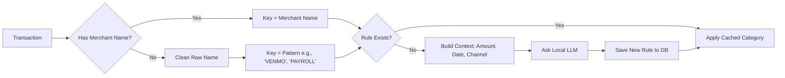

# Plaid Local Analysis

A local-first tool for fetching, categorizing, and analyzing your financial data using Plaid and a local LLM.

## Architecture

This project is a unified Python backend using FastAPI, SQLModel, and Pytest.

```mermaid
graph TD
    subgraph "External"
        PlaidAPI[Plaid API]
        LocalLLM[Local LLM (Llama.cpp)]
    end

    subgraph "Local Environment"
        DB[(SQLite DB)]
        
        subgraph "Python Suite"
            Sync[modules/plaid_integration/sync.py]
            Categorizer[modules/analytics/categorizer.py]
            Reporter[reports/portfolio_summary.py]
        end
    end

    PlaidAPI -->|Transactions & Holdings| Sync
    Sync -->|Raw Data| DB
    
    DB -->|Uncategorized Txs| Categorizer
    Categorizer <-->|Inference| LocalLLM
    Categorizer -->|Category Rules| DB
    
    DB -->|Enriched Data| Reporter
    Reporter -->|Summary| User
```

## Workflow

### 1. Setup Authentication (One-Time)
1. Copy `.env.example` to `.env` and fill in your `PLAID_CLIENT_ID` and `PLAID_SECRET`.
2. Start the API server:
   ```bash
   uv run python main.py
   ```
3. Open `http://localhost:8000`, click **Connect a Bank Account**, and link your institution.
4. **Copy the Access Token** displayed on the screen and paste it into your `.env` file as `PLAID_ACCESS_TOKEN`.

### 2. Routine Sync & Analysis
Run the provided refresh script from the **project root** to keep your data up to date:
```bash
# Windows
.\scripts\daily_refresh.ps1

# Linux/Mac
./scripts/daily_refresh.sh
```

Alternatively, you can run individual modules:
- Sync Data: `uv run python -m modules.plaid_integration.sync`
- Categorize: `uv run python -m modules.analytics.categorizer`
- View Reports: `uv run python -m reports.portfolio_summary`

## Categorization Logic

The system uses a robust two-layer approach to handle messy bank data:


