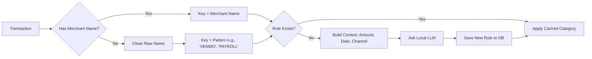

# Plaid Local Analysis

A local-first tool for fetching, categorizing, and analyzing your financial data using Plaid and a local LLM.

## Architecture

This project is split into two distinct parts:
1. **`auth_utility/`**: A web app for the one-time setup of linking your bank account.
2. **`analysis/`**: A standalone Python suite for fetching data, classifying transactions via LLM, and generating reports.

```mermaid
graph TD
    subgraph "External"
        PlaidAPI[Plaid API]
        LocalLLM[Local LLM (Llama.cpp)]
    end

    subgraph "Local Environment"
        DB[(SQLite DB)]
        
        subgraph "Analysis Suite"
            Sync[services/sync.py]
            Categorizer[services/llm_categorizer.py]
            Reporter[reporting/portfolio_summary.py]
        end
    end

    PlaidAPI -->|Transactions & Holdings| Sync
    Sync -->|Raw Data| DB
    
    DB -->|Uncategorized Txs| Categorizer
    Categorizer <-->|Inference| LocalLLM
    Categorizer -->|Category Rules| DB
    
    DB -->|Enriched Data| Reporter
    Reporter -->|Summary| User
```

## Workflow

### 1. Setup Authentication (One-Time)
1. Copy `.env.example` to `.env` and fill in your `PLAID_CLIENT_ID` and `PLAID_SECRET`.
2. Start the auth utility:
   ```bash
   cd auth_utility && pnpm install-all && pnpm start
   ```
3. Open `http://localhost:5173`, link your bank account.
4. **Copy the Access Token** displayed on the screen and paste it into your `.env` file as `PLAID_ACCESS_TOKEN`.

### 2. Routine Sync & Analysis
Run these commands from the **project root** to keep your data up to date.

#### Step A: Sync Data
Downloads the last 2 years of transactions and investment history.
```bash
python -m analysis.main
```

#### Step B: Categorize (Local LLM)
Uses your local `llama.cpp` server (expected at `http://127.0.0.1:8080`) to classify new merchants.
- **First Run:** Categorizes everything.
- **Future Runs:** Only sends **new/unknown** merchants to the LLM. Known patterns use cached rules.

```bash
python -m analysis.services.llm_categorizer
```

#### Step C: View Reports
Generates spending breakdowns, portfolio value, and historical cash flow analysis.
```bash
python -m analysis.reporting.portfolio_summary
```

## Categorization Logic

The system uses a robust two-layer approach to handle messy bank data:



## Directory Structure
- `analysis/db/`: SQLAlchemy models and SQLite session management.
- `analysis/services/`: Core logic (Syncing, Categorization, Data Access Layer).
- `analysis/reporting/`: Analysis scripts and summaries.
- `auth_utility/`: React/FastAPI app for Plaid Link (can be ignored after setup).
